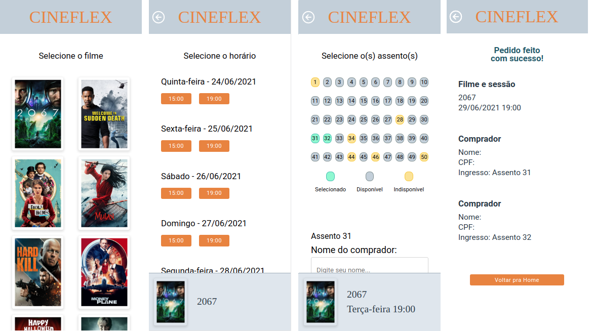

# Cineflex

Cineflex is a single-page application that simulates a Ticketmaster-like website. The movie, session, and seats data comes from the API provided by Responde Ai. The user can select any number of seats at any particular session for any particular movie and enter their name and CPF for each selected seat to "purchase a ticket". I've put that in quotes because there is no checkout implementation in the project and the API will accept any submission as long as it fits the expected data structure. 

## Built With

- React , JavaScript , CSS3 , HTML5  
- Windows, Linux

## Live Demo

[Live Demo Link](https://cineflex-cisw0s3gt-vitorelourenco.vercel.app/)

## Instalation

Get the ./src and ./public files from the repo however you prefer and run the following commands
- create-react-app folder_name --template @bootcamp-ra/cra-template
- yarn add react-router-dom
- yarn add styled-components
- yarn add react-ionicons

## Dependencies
"axios": "^0.21.1"
"react": "^17.0.2"
"react-dom": "^17.0.2"
"react-ionicons": "^4.2.0"
"react-router-dom": "^5.2.0"
"react-scripts": "4.0.3"
"styled-components": "^5.3.0"

## Preview

run the command:
- yarn start

## Build

run the command:
- yarn build

## Deploy

You can deploy this project on vercel.com by pushing it to github and linking Vercel to it

## Authors

👤 **Vitor Emanuel Lourenco**

- GitHub: [@vitorelourenco](https://github.com/vitorelourenco)
- Twitter: [@Vitorel](https://twitter.com/Vitorel)
- LinkedIn: [vitoremanuellourenco](https://www.linkedin.com/in/vitoremanuellourenco/)

## 🤝 Contributing

Contributions, issues, and feature requests are welcome!

Feel free to check the [issues page](https://github.com/vitorelourenco/cineflex/issues).

## Show your support

Give a ⭐️ if you like this project!

## Acknowledgments

- RespondeAi (https://www.respondeai.com.br/)
- The Odin Project (https://www.theodinproject.com/)
